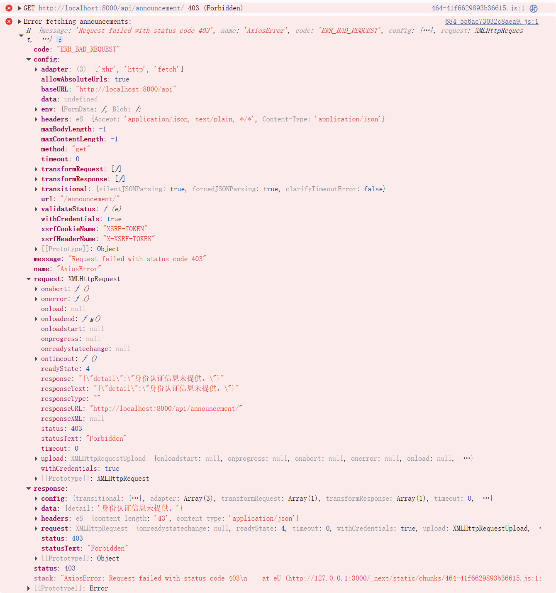
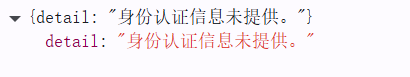
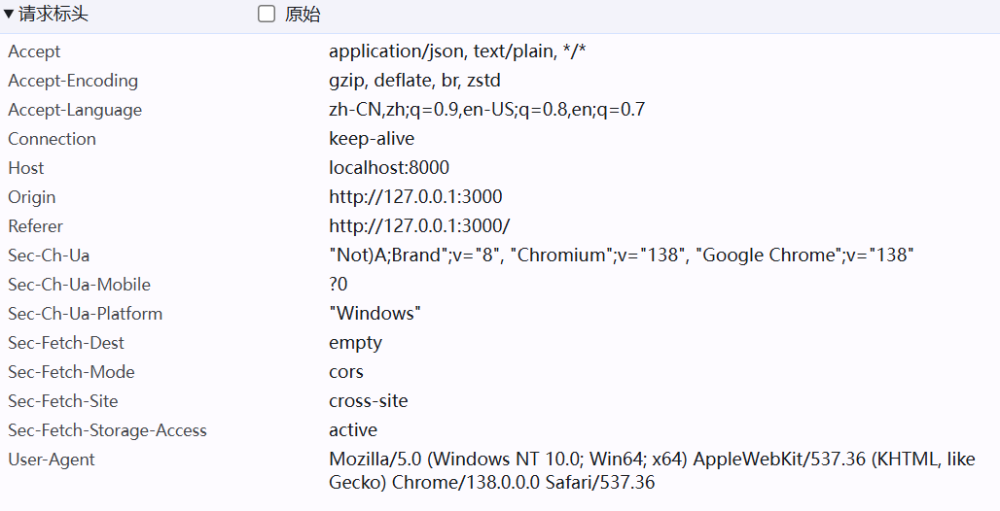
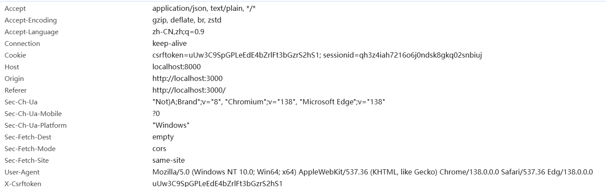
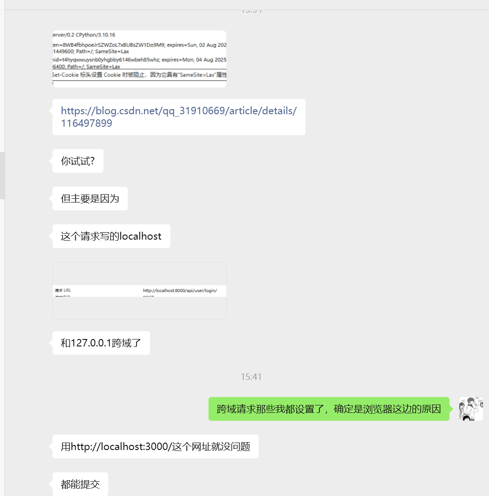

### 问题描述

用户可以正常注册、登录，但是登录过后点击其他页面提示403。

### 范围：

大部分用户：hkd、sw、zgy、ly。

未出现：我的所有设备、ytt的工位电脑、406会议室笔记本

### 报错信息

#### 控制台

#### 返回包

#### 请求标头

#### 正常的请求标头

#### 问题：

可以看到没有Cookie。

### 参考资料

[dajngo设置cookie的samesite属性_django 设置samesite-CSDN博客](https://blog.csdn.net/qq_31910669/article/details/116497899)

### GPT建议

使用 JWT 替代 Session + CSRF（面向未来）

如果系统后续计划长期使用、部署在公网，建议切换成 **JWT 认证** 模式：

- 不依赖 Cookie，所有请求使用 `Authorization: Bearer <token>`；
- 前端保存 token（如 localStorage）；
- 后端不需要 CSRF 验证；
- 跨域也不容易出问题。

这会从根本上消除 Cookie 传输的所有困扰，但需要你重构认证系统（可以后考虑）。

### 最终做法

